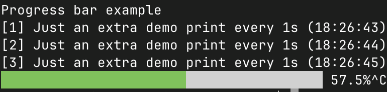
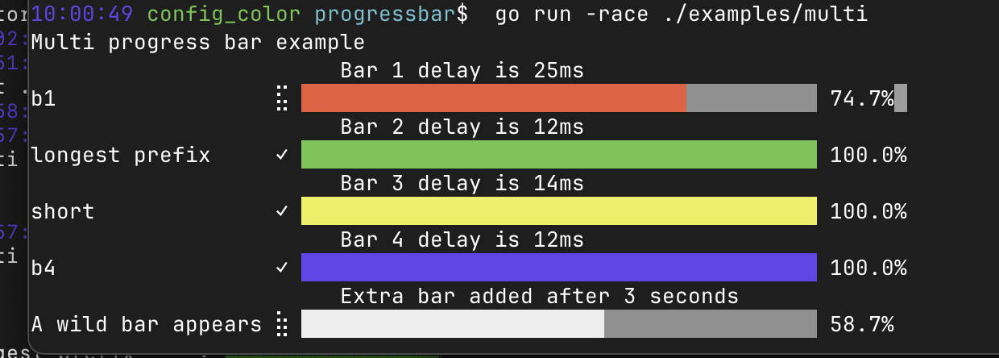

# progressbar
[](https://pkg.go.dev/fortio.org/progressbar)
[](https://goreportcard.com/report/fortio.org/progressbar)
[](https://github.com/fortio/progressbar/actions/workflows/include.yml)
[](https://github.com/fortio/progressbar/releases/)


Zero dependency cross platform (just needs basic ANSI codes and Unicode font support,
and ANSI codes can be disabled too if needed) golang concurrent safe progress bar for terminal/CLIs, with 8x the resolution of others (8 steps per character).

Shows a spinner and/or a progress bar with optional prefix and extra info.

Also provides reader/writer wrappers to automatically show progress of downloads/uploads
or other io operations, as well as a Writer that can be used concurrently with the progress bar to show other output on screen.

## Examples

See [examples/](examples/)

### Manually updating a progress bar and additional output

Manually handling a 2-line output update (1 misc line and the 1 line for the progress bar):

```go
	pb := progressbar.NewBar()
	fmt.Print("Progress bar example\n\n") // 1 empty line before the progress bar, for the demo
	n := 1000
	for i := 0; i <= n; i++ {
		pb.ProgressBar(100. * float64(i) / float64(n))
		if i%63 == 0 {
			progressbar.MoveCursorUp(1)
			fmt.Printf("Just an extra demo print for %d\n", i)
		}
		time.Sleep(20 * time.Millisecond)
	}
```

Source: [examples/simple/simple.go](examples/simple/example.go) (`-moveup` mode)

### Concurrent safe screen writer example

```go
	pb := progressbar.NewBar()
	w := pb.Writer()
	fmt.Fprintln(w, "Progress bar example")
	// demonstrate concurrency safety:
	go PrintStuff(w, *everyFlag)
	// exact number of 'pixels', just to demo every smooth step:
	n := pb.Width * 8
	for i := 0; i <= n; i++ {
		pb.ProgressBar(100. * float64(i) / float64(n))
		time.Sleep(*delayFlag)
	}
```

```sh
go run fortio.org/progressbar/examples/simple@latest -color
```

Produces



Or without color:
```
◅███████████████████████████▊            ▻ 69.4%
```

Source: [examples/simple/example.go](examples/simple/example.go) (default mode)

### Automatic Reader or Writer progress bar

```go
	reader := progressbar.NewAutoReader(progressbar.NewBar(), resp.Body, resp.ContentLength)
	_, err = io.Copy(os.Stdout, reader)
	reader.Close()
```

See it in action with a progress bar while downloading a URL:
```sh
go run fortio.org/progressbar/examples/auto@latest https://go.dev/ > go_dev.html
```

Will show a progress bar for instance
```
$  go run ./examples/auto https://go.dev/dl/go1.24.1.src.tar.gz > /dev/null
Fetching https://go.dev/dl/go1.24.1.src.tar.gz
⣾ █████████████████████▌                   53.7% 15.766 Mb out of 29.352 Mb, 293ms elapsed, 53.790 Mb/s, 253ms remaining
```

Source (now includes a multi bar separating R/W): [auto_examples/auto/auto_example.go](auto_examples/auto/auto_example.go)


### Multiple Bars updating concurrently
```go
	cfg := progressbar.DefaultConfig()
	cfg.ExtraLines = 1
	cfg.ScreenWriter = os.Stdout
	mbar := cfg.NewMultiBarPrefixes(
		"b1",
		"longest prefix",
		"short",
		"b4",
	)
	wg := sync.WaitGroup{}
	for i, bar := range mbar {
		wg.Add(1)
		// Update at random speed so bars move differently for a demo:
		delay := time.Duration(5+rand.IntN(40)) * time.Millisecond
		bar.WriteAbove(fmt.Sprintf("\t\t\tBar %d delay is %v", i+1, delay))
		go func(b *progressbar.State) {
			UpdateBar(b, delay)
			wg.Done()
		}(bar)
	}
	wg.Wait()
	progressbar.MultiBarEnd(mbar)
```



Complete source: [multi_example/multi_example.go](multi_example/multi_example.go)

Which includes adding extra bars dynamically.

### Multicurl
You can see it in use in [fortio/multicurl](https://github.com/fortio/multicurl?tab=readme-ov-file#multicurl) cli too.

## See also

If you have more advanced needs for TUI including raw mode input or readline, you can also see/use/have a look at

[github.com/fortio/terminal](https://github.com/fortio/terminal#terminal)

And still use this for a progress bar part.

It is used for instance in [github.com/fortio/fps's web mode progress update](https://github.com/fortio/fps#web-serving-fire-mode)

And [grol](https://github.com/grol-io/grol#grol)'s multi file processing progress info (`make grol-tests`)
